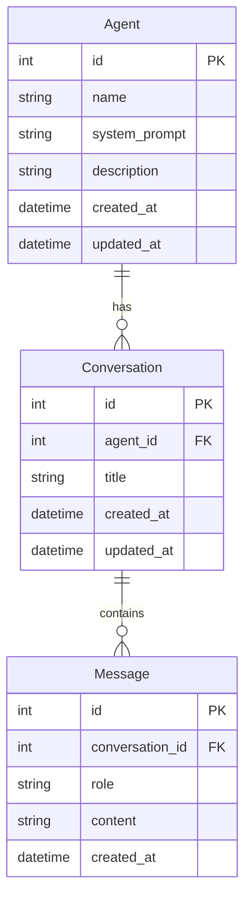

# AI Agent Platform - Design Document

## Overview

AI Agent 平台是一个前后端分离的 Web 应用，允许用户创建具有不同角色设定的 AI 智能体，并与之进行多轮对话。后端使用 FastAPI 框架，集成大语言模型 API（支持通义千问/OpenAI），使用 SQLite 进行数据持久化。前端采用简单的 HTML + JavaScript 实现，通过 RESTful API 与后端通信。

### 技术栈

**后端：**
- Python 3.10+
- FastAPI（Web 框架）
- SQLAlchemy（ORM，异步支持）
- aiosqlite（异步 SQLite 驱动）
- Pydantic（数据验证）
- httpx（异步 HTTP 客户端，调用 LLM API）

**前端：**
- HTML5 + CSS3
- Vanilla JavaScript（无框架，便于学习）
- Fetch API（HTTP 请求）

**数据库：**
- SQLite（轻量级，无需额外安装）

## Architecture

```
┌─────────────────────────────────────────────────────────────────┐
│                        Frontend (Static)                        │
│  ┌──────────────┐  ┌──────────────┐  ┌──────────────────────┐  │
│  │  Agent List  │  │  Chat View   │  │  Agent Create Form   │  │
│  └──────────────┘  └──────────────┘  └──────────────────────┘  │
└─────────────────────────────┬───────────────────────────────────┘
                              │ HTTP/REST
                              ▼
┌─────────────────────────────────────────────────────────────────┐
│                     FastAPI Backend                             │
│  ┌─────────────────────────────────────────────────────────┐   │
│  │                    API Layer (Routers)                   │   │
│  │  /api/agents  │  /api/conversations  │  /api/messages   │   │
│  └─────────────────────────────────────────────────────────┘   │
│                              │                                  │
│  ┌─────────────────────────────────────────────────────────┐   │
│  │                   Service Layer                          │   │
│  │  AgentService  │  ConversationService  │  LLMService    │   │
│  └─────────────────────────────────────────────────────────┘   │
│                              │                                  │
│  ┌─────────────────────────────────────────────────────────┐   │
│  │                 Repository Layer (DAL)                   │   │
│  │  AgentRepository  │  ConversationRepository             │   │
│  └─────────────────────────────────────────────────────────┘   │
│                              │                                  │
└──────────────────────────────┼──────────────────────────────────┘
                               │
                               ▼
┌──────────────────────────────────────────────────────────────────┐
│                         SQLite Database                          │
│  ┌──────────┐  ┌───────────────┐  ┌──────────┐                  │
│  │  agents  │  │ conversations │  │ messages │                  │
│  └──────────┘  └───────────────┘  └──────────┘                  │
└──────────────────────────────────────────────────────────────────┘

                               │
                               ▼ (async HTTP)
┌──────────────────────────────────────────────────────────────────┐
│                    External LLM API                              │
│         (通义千问 / OpenAI / 其他兼容 API)                        │
└──────────────────────────────────────────────────────────────────┘
```

### 分层架构说明

1. **API Layer（路由层）**: 处理 HTTP 请求，参数验证，调用 Service 层
2. **Service Layer（服务层）**: 业务逻辑，协调多个 Repository
3. **Repository Layer（数据访问层）**: 数据库 CRUD 操作
4. **LLM Service**: 封装大模型 API 调用逻辑

## Components and Interfaces

### 1. API Routers

#### AgentRouter (`/api/agents`)

```python
# 路由定义
POST   /api/agents           # 创建 Agent
GET    /api/agents           # 获取 Agent 列表
GET    /api/agents/{id}      # 获取单个 Agent
PUT    /api/agents/{id}      # 更新 Agent
DELETE /api/agents/{id}      # 删除 Agent
```

#### ConversationRouter (`/api/conversations`)

```python
# 路由定义
POST   /api/agents/{agent_id}/conversations           # 创建对话
GET    /api/agents/{agent_id}/conversations           # 获取对话列表
GET    /api/conversations/{id}                        # 获取对话详情
DELETE /api/conversations/{id}                        # 删除对话
```

#### MessageRouter (`/api/messages`)

```python
# 路由定义
POST   /api/conversations/{conversation_id}/messages  # 发送消息
GET    /api/conversations/{conversation_id}/messages  # 获取消息历史
```

### 2. Service Interfaces

```python
class AgentService:
    async def create_agent(self, data: AgentCreate) -> Agent
    async def get_agents(self) -> List[Agent]
    async def get_agent(self, agent_id: int) -> Agent
    async def update_agent(self, agent_id: int, data: AgentUpdate) -> Agent
    async def delete_agent(self, agent_id: int) -> bool

class ConversationService:
    async def create_conversation(self, agent_id: int) -> Conversation
    async def get_conversations(self, agent_id: int) -> List[Conversation]
    async def get_conversation(self, conversation_id: int) -> Conversation
    async def delete_conversation(self, conversation_id: int) -> bool

class MessageService:
    async def send_message(self, conversation_id: int, content: str) -> Message
    async def get_messages(self, conversation_id: int) -> List[Message]

class LLMService:
    async def chat(self, messages: List[dict], system_prompt: str) -> str
```

### 3. Repository Interfaces

```python
class AgentRepository:
    async def create(self, agent: AgentCreate) -> Agent
    async def get_all(self) -> List[Agent]
    async def get_by_id(self, agent_id: int) -> Optional[Agent]
    async def update(self, agent_id: int, data: AgentUpdate) -> Agent
    async def delete(self, agent_id: int) -> bool

class ConversationRepository:
    async def create(self, agent_id: int) -> Conversation
    async def get_by_agent(self, agent_id: int) -> List[Conversation]
    async def get_by_id(self, conversation_id: int) -> Optional[Conversation]
    async def delete(self, conversation_id: int) -> bool

class MessageRepository:
    async def create(self, conversation_id: int, role: str, content: str) -> Message
    async def get_by_conversation(self, conversation_id: int) -> List[Message]
```

## Data Models

### Database Schema (SQLAlchemy Models)

```python
class Agent(Base):
    __tablename__ = "agents"
    
    id: int              # 主键，自增
    name: str            # Agent 名称，非空
    system_prompt: str   # 系统提示词
    description: str     # 描述（可选）
    created_at: datetime # 创建时间
    updated_at: datetime # 更新时间

class Conversation(Base):
    __tablename__ = "conversations"
    
    id: int              # 主键，自增
    agent_id: int        # 外键，关联 Agent
    title: str           # 对话标题（可选，可从首条消息生成）
    created_at: datetime # 创建时间
    updated_at: datetime # 更新时间

class Message(Base):
    __tablename__ = "messages"
    
    id: int              # 主键，自增
    conversation_id: int # 外键，关联 Conversation
    role: str            # 角色：user / assistant / system
    content: str         # 消息内容
    created_at: datetime # 创建时间
```

### Pydantic Schemas (API 数据传输)

```python
# Agent Schemas
class AgentCreate(BaseModel):
    name: str = Field(..., min_length=1, max_length=100)
    system_prompt: str = Field(default="You are a helpful assistant.")
    description: Optional[str] = None

class AgentUpdate(BaseModel):
    name: Optional[str] = Field(None, min_length=1, max_length=100)
    system_prompt: Optional[str] = None
    description: Optional[str] = None

class AgentResponse(BaseModel):
    id: int
    name: str
    system_prompt: str
    description: Optional[str]
    created_at: datetime
    updated_at: datetime

# Conversation Schemas
class ConversationCreate(BaseModel):
    title: Optional[str] = None

class ConversationResponse(BaseModel):
    id: int
    agent_id: int
    title: Optional[str]
    created_at: datetime
    message_count: int  # 消息数量（计算字段）

# Message Schemas
class MessageCreate(BaseModel):
    content: str = Field(..., min_length=1)

class MessageResponse(BaseModel):
    id: int
    conversation_id: int
    role: str
    content: str
    created_at: datetime

# 统一响应格式
class APIResponse(BaseModel, Generic[T]):
    success: bool
    data: Optional[T] = None
    error: Optional[str] = None
```

### Entity Relationship Diagram



## Correctness Properties

*A property is a characteristic or behavior that should hold true across all valid executions of a system-essentially, a formal statement about what the system should do. Properties serve as the bridge between human-readable specifications and machine-verifiable correctness guarantees.*

### Property 1: Agent CRUD Round-Trip

*For any* valid Agent data (non-empty name, valid system prompt), creating an Agent and then retrieving it by ID should return an Agent with identical name and system_prompt fields.

**Validates: Requirements 1.1, 1.3**

### Property 2: Agent Update Persistence

*For any* existing Agent and valid update data, updating the Agent and then retrieving it should reflect all the updated fields.

**Validates: Requirements 1.4**

### Property 3: Agent Deletion Cascade

*For any* Agent with associated Conversations, deleting the Agent should result in both the Agent and all its Conversations being removed from the system.

**Validates: Requirements 1.5**

### Property 4: Empty Name Rejection

*For any* string composed entirely of whitespace or empty string, attempting to create an Agent with such a name should be rejected with a validation error.

**Validates: Requirements 1.6**

### Property 5: Conversation Message Ordering

*For any* Conversation with multiple Messages, retrieving the message history should return Messages in chronological order (ascending by created_at).

**Validates: Requirements 2.3**

### Property 6: Conversation Deletion Cascade

*For any* Conversation with Messages, deleting the Conversation should result in both the Conversation and all its Messages being removed.

**Validates: Requirements 2.5**

### Property 7: Message Context Accumulation

*For any* Conversation, when sending a new message, the LLM request should include all previous messages in the conversation as context.

**Validates: Requirements 2.6, 3.1**

### Property 8: LLM Message Serialization Round-Trip

*For any* valid Message object, serializing it to LLM format and then parsing a response should preserve the message structure and content.

**Validates: Requirements 3.5, 3.6**

### Property 9: Error Response Consistency

*For any* invalid request (validation error or not found), the API should return the appropriate HTTP status code (422 or 404) with a consistent error response structure.

**Validates: Requirements 5.4, 5.5**

### Property 10: JSON Response Structure

*For any* successful API response, the response body should contain a consistent structure with `success`, `data`, and optionally `error` fields.

**Validates: Requirements 5.2**

## Error Handling

### Error Categories

| Error Type | HTTP Status | Description |
|------------|-------------|-------------|
| ValidationError | 422 | 请求数据验证失败 |
| NotFoundError | 404 | 资源不存在 |
| LLMError | 502 | LLM API 调用失败 |
| TimeoutError | 504 | LLM API 超时 |
| DatabaseError | 500 | 数据库操作失败 |

### Error Response Format

```python
{
    "success": false,
    "data": null,
    "error": {
        "code": "VALIDATION_ERROR",
        "message": "Agent name cannot be empty",
        "details": {...}  # 可选，详细错误信息
    }
}
```

### Exception Handling Strategy

```python
# 全局异常处理器
@app.exception_handler(ValidationError)
async def validation_exception_handler(request, exc):
    return JSONResponse(status_code=422, content={...})

@app.exception_handler(NotFoundError)
async def not_found_exception_handler(request, exc):
    return JSONResponse(status_code=404, content={...})

@app.exception_handler(LLMError)
async def llm_exception_handler(request, exc):
    logger.error(f"LLM Error: {exc}")
    return JSONResponse(status_code=502, content={...})
```

## Testing Strategy

### Testing Framework

- **pytest**: 主测试框架
- **pytest-asyncio**: 异步测试支持
- **hypothesis**: 属性测试库（Property-Based Testing）
- **httpx**: 异步 HTTP 客户端（用于 API 测试）

### Unit Tests

单元测试覆盖以下核心组件：

1. **Pydantic Schema 验证**
   - 测试 AgentCreate 的 name 字段验证
   - 测试 MessageCreate 的 content 字段验证

2. **Service 层逻辑**
   - 测试 AgentService 的 CRUD 操作
   - 测试 ConversationService 的对话管理
   - 测试 MessageService 的消息处理

3. **LLM Service**
   - 测试消息格式化
   - 测试错误处理
   - 测试超时处理

### Property-Based Tests

使用 Hypothesis 库实现属性测试，每个测试运行至少 100 次迭代：

```python
from hypothesis import given, strategies as st, settings

@settings(max_examples=100)
@given(name=st.text(min_size=1, max_size=100).filter(lambda x: x.strip()))
def test_agent_crud_roundtrip(name):
    """
    **Feature: ai-agent-platform, Property 1: Agent CRUD Round-Trip**
    """
    # 创建 Agent，然后获取，验证数据一致
    pass

@settings(max_examples=100)
@given(name=st.text(max_size=100).filter(lambda x: not x.strip()))
def test_empty_name_rejection(name):
    """
    **Feature: ai-agent-platform, Property 4: Empty Name Rejection**
    """
    # 尝试创建空名称 Agent，验证被拒绝
    pass
```

### Test Organization

```
tests/
├── conftest.py              # pytest fixtures
├── unit/
│   ├── test_schemas.py      # Pydantic schema tests
│   ├── test_services.py     # Service layer tests
│   └── test_llm.py          # LLM service tests
├── integration/
│   ├── test_agents_api.py   # Agent API tests
│   ├── test_conversations_api.py
│   └── test_messages_api.py
└── properties/
    ├── test_agent_properties.py    # Agent property tests
    ├── test_conversation_properties.py
    └── test_message_properties.py
```

### Test Configuration

```python
# pytest.ini
[pytest]
asyncio_mode = auto
testpaths = tests
python_files = test_*.py
python_functions = test_*

# conftest.py
@pytest.fixture
async def test_db():
    """创建测试数据库"""
    engine = create_async_engine("sqlite+aiosqlite:///:memory:")
    async with engine.begin() as conn:
        await conn.run_sync(Base.metadata.create_all)
    yield engine
    await engine.dispose()

@pytest.fixture
async def client(test_db):
    """创建测试客户端"""
    app.dependency_overrides[get_db] = lambda: test_db
    async with AsyncClient(app=app, base_url="http://test") as ac:
        yield ac
```
